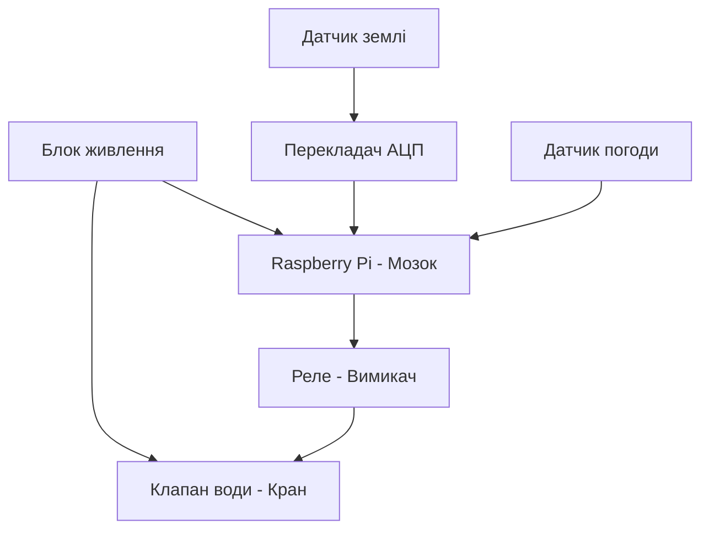

# Курсова робота

## Тема: Контроль поливом

Коваленко Михайло

 Група КС-1-2
 
 ---
 ## Основні ідеї проєкту (завдання) 
 **Опис та підключення датчика:** один датчик згідно з варіантом.
 
  Опис таведення архіву даних на Edge-рівні. 
  
  Опис та підклюінтерфейс для підключення та керування з телефону через WiFi.

   датчика: один датчиреалізація протоколів MQTT, WebSocket та HTTP.

  
 та підключення розробка та впровадження одного основного алгоритму реалізації: одизбір та відображення статистики в хмарі.
  
  
  Опис та підключналаштування автоматичних повідомлень через Discord або Telegram.

## 4. Розроблення структурної схеми

Опис роботи структурної схеми:
Система працює автоматично. Датчики вологості ґрунту та погоди (DHT22) передають дані на Raspberry Pi. Оскільки датчик ґрунту аналоговий, сигнал проходить через перетворювач АЦП MCP3008. Якщо земля суха, Raspberry Pi через модуль реле відкриває електромагнітний клапан і вмикає полив.

## 5. Опис та підключення датчиків

Для контролю зволоження саду у проекті використано ємнісний датчик вологості ґрунту Capacitive Soil Moisture Sensor v1.2.

### Принцип роботи датчика:
Датчик вимірює діелектричну проникність ґрунту за допомогою ємнісного вимірювання, що безпосередньо залежить від кількості вологи в землі. На відміну від дешевих резистивних датчиків, цей модуль не має відкритих металевих контактів на щупі, тому він не піддається корозії (іржавінню) та служить значно довше в умовах постійної вологості.

### Підключення до Raspberry Pi:
Оскільки датчик видає аналоговий сигнал (напругу, яка змінюється залежно від сухості землі), а Raspberry Pi не має власних аналогових входів (GPIO розуміють тільки "0" або "1"), підключення виконується через аналогово-цифровий перетворювач (АЦП) MCP3008 за такою схемою:

1. Датчик ґрунту ➔ АЦП MCP3008:
   * VCC (живлення) ➔ 3.3V або 5V
   * GND (земля) ➔ GND
   * AOUT (аналоговий вихід) ➔ до аналогового каналу CH0 на мікросхемі MCP3008.

2. АЦП MCP3008 ➔ Raspberry Pi (через інтерфейс SPI):
   * VDD/VREF ➔ 3.3V на Raspberry Pi
   * AGND/DGND ➔ GND на Raspberry Pi
   * CLK (тактування) ➔ GPIO 11 (SCLK)
   * DOUT (вихід даних) ➔ GPIO 9 (MISO)
   * DIN (вхід даних) ➔ GPIO 10 (MOSI)
   * CS/SHDN (вибір мікросхеми) ➔ GPIO 8 (CE0)

