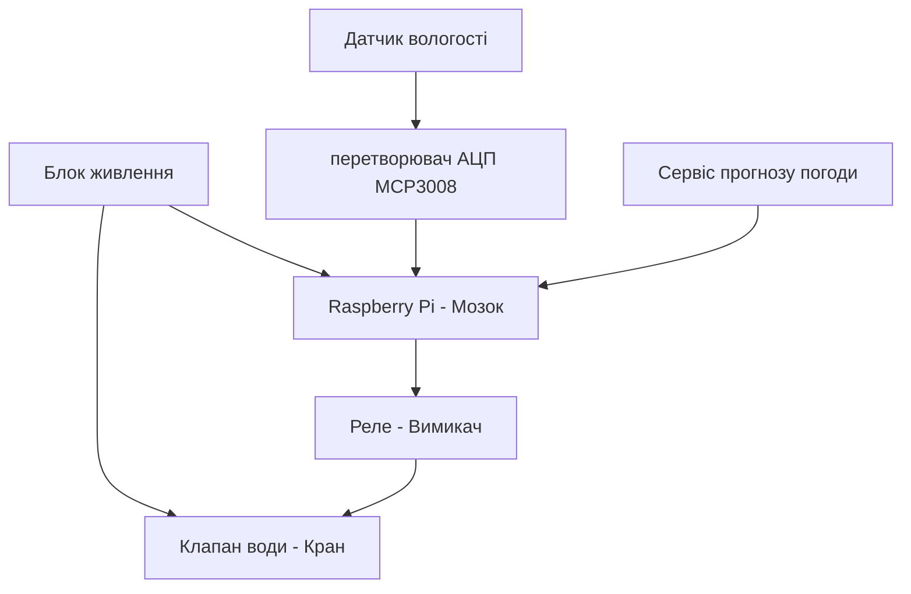

# Курсова робота

## Тема: Контроль поливом

Коваленко Михайло

 Група КС-1-2
 
 # Вступ 

Сучасний світ вимагає все більшої автоматизації та інтелектуального управління ресурсами, особливо в таких галузях, як сільське господарство, ландшафтний дизайн та домашнє садівництво. Одним із ключових аспектів ефективного вирощування рослин є підтримка оптимального рівня вологості ґрунту, що безпосередньо впливає на їхній ріст і розвиток. Традиційний ручний полив часто є недостатньо точним, надмірним або, навпаки, недостатнім, що призводить до втрат води та погіршення стану рослин. У зв’язку з цим актуальним є створення розумних систем автоматичного поливу, здатних аналізувати стан ґрунту та навколишнього середовища та приймати обґрунтовані рішення щодо поливу в реальному часі.

Метою даного проекту є розробка та реалізація автоматизованої системи поливу на базі мікрокомп’ютера Raspberry Pi, яка забезпечує точне вимірювання вологості ґрунту та параметрів навколишнього середовища, локальне архівування даних, автономне прийняття рішень та дистанційне керування через WiFi. Особливістю системи є використання сучасних датчиків, зокрема ємнісного датчика вологості ґрунту, що виключає проблему корозії, а також реалізація Edge-обчислення з можливістю подальшої інтеграції з хмарними сервісами.

Проект передбачає комплексний підхід до побудови IoT-системи: від вибору апаратного забезпечення та підключення датчиків до реалізації програмної логіки, підтримки мережевих протоколів (MQTT, WebSocket, HTTP), організації локального архіву даних у SQLite, створення інтерфейсу для керування з мобільного пристрою та налаштування автоматичних повідомлень через Telegram або Discord. Усе це дозволяє створити надійну, автономну та розширювану систему, придатну для використання як в побутових, так і в промислових умовах.

Розроблена система не лише оптимізує витрати води, але й забезпечує безперебійну роботу навіть при відсутності інтернет-з’єднання, завдяки локальній обробці даних на рівні Edge. Це робить її стійкою до збоїв зв’язку та придатною для використання в умовах, де зв’язок із хмарою є нестабільним.

У подальшому в роботі наведено детальний опис апаратної та програмної реалізації проекту, архітектури системи, принципів роботи датчиків, механізмів збору, зберігання та передачі даних, а також шляхів інтеграції з користувацькими інтерфейсами та зовнішніми сервісами.

 
 ---
 ## Основні ідеї проєкту (завдання) 
 **Опис та підключення датчика:** один датчик згідно з варіантом.
 
  Опис таведення архіву даних на Edge-рівні. 
  
  Опис та підклюінтерфейс для підключення та керування з телефону через WiFi.

   датчика: один датчиреалізація протоколів MQTT, WebSocket та HTTP.

  
 та підключення розробка та впровадження одного основного алгоритму реалізації: одизбір та відображення статистики в хмарі.
  
  
  Опис та підключналаштування автоматичних повідомлень через Discord або Telegram.

  

## РОЗДІЛ 1. ЗАГАЛЬНА ХАРАКТЕРИСТИКА СИСТЕМИ АВТОМАТИЗОВАНОГО КОНТРОЛЮ ПОЛИВОМ
### 1.1 Суть та призначення системи
Система автоматизованого контролю поливом призначена для підтримання оптимального рівня вологості ґрунту в саду без участі людини. Основна ідея полягає в тому, що датчики постійно стежать за станом ґрунту та погодними умовами, а при падінні вологості нижче допустимого рівня — система самостійно вмикає полив і вимикає його після досягнення потрібного показника.
Система вирішує три ключові задачі:

Моніторинг — безперервне зчитування вологості ґрунту та температури/вологості повітря;
Управління — автоматичне вмикання та вимикання поливу за алгоритмом;
Інформування — передача даних у хмару та сповіщення користувача через месенджер.

### 1.2 Апаратний склад системи
Система побудована на базі Raspberry Pi як центрального керуючого модуля. Він обрано з огляду на достатню обчислювальну потужність для Edge-обробки даних, підтримку повноцінної ОС Linux та локальної бази даних SQLite, а також наявність інтерфейсів SPI та GPIO для підключення периферії.
До складу системи входять такі пристрої:

Capacitive Soil Moisture Sensor v1.2 — ємнісний датчик вологості ґрунту. На відміну від резистивних аналогів, його контакти покриті лаком і не контактують із водою, що виключає корозію та забезпечує тривалу роботу в землі. Датчик видає аналоговий сигнал напруги.
MCP3008 — 10-бітний аналогово-цифровий перетворювач (АЦП), що підключається до Raspberry Pi по протоколу SPI. Необхідний тому, що Raspberry Pi не має власних аналогових входів і не може безпосередньо зчитати сигнал з ємнісного датчика — MCP3008 перетворює аналогову напругу в цифровий код.
DHT22 (AM2302) — цифровий датчик температури та вологості повітря. Забезпечує точність вимірювання ±0.5°C по температурі та ±2% по вологості. Передає дані по однопровідному цифровому протоколу напряму на GPIO Raspberry Pi, не використовуючи канали АЦП.
Модуль реле + електромагнітний клапан — виконавчий механізм системи. Оскільки GPIO Raspberry Pi видає лише 3.3V, а електромагнітний клапан потребує зовнішньої напруги 12V, модуль реле виконує роль ізольованого «вимикача»: він отримує сигнал керування від Raspberry Pi і комутує силове живлення клапана.

### 1.3 Принцип роботи системи
Система працює циклічно за таким принципом:

MCP3008 зчитує аналоговий сигнал з датчика вологості ґрунту і передає цифрове значення на Raspberry Pi по SPI.
DHT22 передає показання температури та вологості повітря напряму на GPIO Raspberry Pi.
Raspberry Pi обробляє отримані дані, записує їх у локальну базу даних SQLite та порівнює вологість ґрунту з пороговими значеннями.
Якщо вологість нижче нижнього порогу — Raspberry Pi подає сигнал на модуль реле, яке відкриває електромагнітний клапан і починається полив.
Якщо вологість досягла верхнього порогу — реле отримує команду закрити клапан і полив зупиняється.
Дані передаються до хмарної платформи через протокол MQTT.
При важливих подіях (початок/кінець поливу, критична вологість, помилка датчика) система надсилає сповіщення в Telegram або Discord.

Цей цикл повторюється безперервно, забезпечуючи повністю автономну роботу системи.

### 1.4 Архітектура системи
Система побудована за трирівневою IoT-архітектурою:
Edge-рівень (пристрій) — Raspberry Pi з підключеними датчиками та клапаном. Тут відбувається збір і обробка даних, прийняття рішень та ведення локального архіву в SQLite. Система здатна працювати автономно навіть без підключення до Інтернету.
Fog-рівень (мережа) — Raspberry Pi підключається до домашньої WiFi-мережі та виступає як локальний сервер. Користувач може підключитися зі смартфону через браузер, бачити поточний стан системи, переглядати архів і керувати поливом вручну.
Cloud-рівень (хмара) — дані відправляються на хмарну платформу, де накопичується статистика, будуються графіки та налаштовуються автоматичні сповіщення.

### 1.5 Взаємодія користувача з системою
Користувач може взаємодіяти з системою трьома способами:

Через браузер смартфону — відкривши IP-адресу Raspberry Pi у WiFi-мережі, можна переглядати поточну вологість ґрунту, температуру повітря, стан клапана та керувати поливом вручну;
Через хмарну платформу — перегляд графіків та статистики вологості за будь-який період;
Через Telegram або Discord — отримання автоматичних сповіщень про початок/кінець поливу, критичну вологість або несправності.

### 1.6 Висновок
Система є замкнутим автоматизованим циклом: датчики → Raspberry Pi → клапан → хмара → користувач. Поєднання ємнісного датчика ґрунту, АЦП MCP3008, датчика погоди DHT22 та електромагнітного клапана під керуванням Raspberry Pi забезпечує надійний і точний контроль поливу, що не потребує постійної уваги — садівник отримує лише важливі сповіщення, а вся рутинна робота виконується автоматично.

  

## Розділ 2. Пошук та вибір апаратного забезпечення і розробка архітектури та необхідної проєктної документації

Для реалізації автоматизованої системи поливу було проаналізовано ринок компонентів та обрано наступний комплекс технічних засобів.
Усі рішення, які стосуються вибору технічних та програмних компонентів та їх взаємодії, описуються саме в цьому розділі.
### 2.1
1. Керуючий модуль: Raspberry Pi
   * *Обґрунтування*: Забезпечує високу обчислювальну потужність для Edge-обробки даних, підтримує повноцінну ОС Linux та локальну СКБД SQLite. Має вбудовані інтерфейси SPI та GPIO для роботи з периферією.

2. Датчик вологості ґрунту: Capacitive Soil Moisture Sensor v1.2
   * *Обґрунтування*: На відміну від дешевих резистивних датчиків, цей датчик є ємнісним. Його контакти покриті лаком і не контактують із водою напряму, що повністю виключає корозію (іржавіння) та забезпечує довговічність роботи в землі.

3. Аналогово-цифровий перетворювач (АЦП): MCP3008
   * *Обґрунтування*: Оскільки Raspberry Pi не має власних вбудованих аналогових входів (розуміє лише цифровий сигнал "0" або "1"), для зчитування точних значень напруги з ємнісного датчика ґрунту обрано 10-бітний 8-канальний АЦП MCP3008, який працює по надійному протоколу SPI.

4. Датчик погоди: DHT22 (AM2302)
   * *Обґрунтування*: Має вищу точність вимірювання температури (±0.5°C) та вологості повітря (±2%), а також ширший діапазон вимірювань, ніж аналог DHT11. Передає дані по цифровому однопровідному протоколу, не займаючи канали АЦП.

5. Виконавчі пристрої: Модуль реле та Електромагнітний клапан води
   * *Обґрунтування*: Електромагнітний клапан працює від зовнішньої напруги (зазвичай 12V), тоді як GPIO Raspberry Pi видає лише 3.3V. Модуль реле служить безпечним ізольованим «вимикачем», який дозволяє мікрокомп'ютеру керувати потужним силовим навантаженням (відкриттям/закриттям крану).

### 2.2 Розроблення структурної схеми

Опис роботи структурної схеми:
Система працює автоматично. Датчики вологості ґрунту та погоди (DHT22) передають дані на Raspberry Pi. Оскільки датчик ґрунту аналоговий, сигнал проходить через перетворювач АЦП MCP3008. Якщо земля суха, Raspberry Pi через модуль реле відкриває електромагнітний клапан і вмикає полив.

### 2.3 Опис та підключення датчиків

У моїй курсові роботі я обрав  ємнісний датчик вологості ґрунту Capacitive Soil Moisture Sensor v1.2.

### Принцип роботи датчика:
Датчик вимірює діелектричну проникність ґрунту за допомогою ємнісного вимірювання, що безпосередньо залежить від кількості вологи в землі. На відміну від дешевих резистивних датчиків, цей модуль не має відкритих металевих контактів на щупі, тому він не буде іржавіти в землі, тому прослужить набагато довше в умовах постійної вологості.

### Підключення до Raspberry Pi:
Оскільки датчик видає аналоговий сигнал (напругу, яка змінюється залежно від сухості землі), а Raspberry Pi не має власних аналогових входів (GPIO розуміють тільки "0" або "1"), підключення виконується через аналогово-цифровий перетворювач (АЦП) MCP3008 за такою схемою:

1. Датчик вологості ґрунту ➔ АЦП MCP3008:
   * VCC (живлення) ➔ 3.3V або 5V
   * GND (земля) ➔ GND
   * AOUT (аналоговий вихід) ➔ до аналогового каналу CH0 на мікросхемі MCP3008.

2. АЦП MCP3008 ➔ Raspberry Pi (через інтерфейс SPI):
   * VDD/VREF ➔ 3.3V на Raspberry Pi
   * AGND/DGND ➔ GND на Raspberry Pi
   * CLK (тактування) ➔ GPIO 11 (SCLK)
   * DOUT (вихід даних) ➔ GPIO 9 (MISO)
   * DIN (вхід даних) ➔ GPIO 10 (MOSI)
   * CS/SHDN (вибір мікросхеми) ➔ GPIO 8 (CE0)

Для створення картинки був використаний штучний інтелект

### 2.4 Архівування даних на Edge-рівні

Щоб система поливу працювала стабільно, збір та збереження всієї історії вимірювань я вирішив робити локально. Тобто, дані про вологість землі та погоду збираються й одразу записуються на MicroSD карту самої плати Raspberry Pi.

### Як організовано збереження даних:
* Локальна база даних: Для збереження історії я використовую легку базу даних SQLite. Вона не потребує складного налаштування і працює як один файл прямо на MicroSD карті нашої плати.
* Структура архіву: Програма зчитує датчики кожні 10-15 хвилин та записує в таблицю три параметри: точний час (дата і година), рівень вологості ґрунту та температуру навколишнього середовища.
* Переваги такого підходу: Якщо в саду раптово зникне інтернет або зв'язок із сервером, система не зламається і не втратить дані. Вона продовжить збирати історію локально і зможе автономно приймати рішення про полив рослин.

### 2.5. Технічна структура системи
Проєкт системи контролю поливу в саду побудований на базі мікрокомп'ютера Raspberry Pi, який виступає в ролі Edge-вузла. Оскільки плата Raspberry Pi не має вбудованих аналогових входів (GPIO розуміють тільки "0" або "1"), для зняття показників з аналогового датчика вологості ґрунту використовується аналогово-цифровий перетворювач (АЦП) MCP3008.

Зв'язок між компонентами реалізовано наступним чином:
* Датчик вологості фіксує стан ґрунту та передає аналоговий сигнал на АЦП.
* АЦП MCP3008 оцифровує отримані дані та через інтерфейс SPI передає їх на шину мікрокомп'ютера Raspberry Pi для подальшого аналізу.

### 2.6. Відомість та опис апаратних засобів

Таблиця 2.2. Відомість апаратних засобів

| Найменування | Кількість | Опис | Примітка |
| :--- | :--- | :--- | :--- |
| Raspberry Pi | 1 | [Опис та характеристики платформи Raspberry Pi](https://raspberrypi.com) | Головний контролер системи автоматизації |
| АЦП MCP3008 | 1 | [Специфікація мікросхеми MCP3008 SPI ADC](https://microchip.com) | 10-бітний аналогово-цифровий перетворювач |
| Датчик вологості ґрунту | 1 | [Аналоговий сенсор визначення вологості](https://arduino.ua) | Вимірювання рівня вологості в саду |
| Дроти Dupont | 10 | Сполучні кабелі типу мама-мама / мама-тато | Для комутації елементів системи |

#### Опис обраних технічних засобів

Датчик вологості ґрунту — це стабільний та точний резистивний або ємнісний сенсор, призначений для фіксації рівня вологи у прикореневій зоні рослин. Він видає аналоговий сигнал (напругу), яка змінюється залежно від сухості землі, що дозволяє гнучко налаштовувати пороги автоматичного включення поливу.

### 2.7. Програмна структура системи
Щоб система автоматичного поливу працювала стабільно, збір та збереження всієї історії вимірювань вирішено робити безпосередньо на Edge-рівні. 

Як організовано збереження даних:
* Локальна база даних: Для збереження історії використовується легка база даних SQLite. Вона не потребує окремого сервера, розгортається безпосередньо на MicroSD-карті плати Raspberry Pi та забезпечує високу швидкість запису та автономність системи.

## РОЗДІЛ 3. МЕТОДИКА ПЕРЕВІРКИ ТА ЗАСОБИ ТЕСТУВАННЯ

Перед введенням системи автоматичного поливу в експлуатацію необхідно перевірити правильність роботи всіх її компонентів. Тестування дозволяє переконатися, що дані з датчиків обробляються коректно, алгоритми працюють без помилок, а користувач отримує актуальну інформацію про стан системи. Для цього проводиться поетапна перевірка окремих функцій та всієї системи в цілому.

Оскільки під час розробки не завжди є можливість використовувати реальне обладнання, у проєкті передбачений режим імітації. Він дозволяє тестувати алгоритми роботи системи без підключення фізичних датчиків, АЦП та електромагнітного клапана.

### 3.1 Методика перевірки підсистеми Edge-рівня

Перевірка підсистеми Edge-рівня виконується за такими напрямками:

* перевірка функцій вводу та виводу даних;
* перевірка веб-інтерфейсу користувача;
* перевірка архівування інформації;
* перевірка системи сповіщень.

### 3.1.1 Перевірка функцій вводу та виводу

Для перевірки роботи датчика вологості ґрунту виконуються такі дії:

1. Запускається середовище Node-RED та відкривається вікно Debug.
2. Перевіряється надходження даних від АЦП MCP3008.
3. Контролюється правильність перетворення цифрових значень у відсотки вологості.
4. Перевіряється, чи знаходяться результати в межах від 0 до 100 %.
5. Контролюється оновлення даних з інтервалом приблизно одна секунда.

Для перевірки роботи датчика DHT22 необхідно:

1. Зчитати значення температури повітря.
2. Зчитати значення вологості повітря.
3. Переконатися, що обидва параметри відображаються окремо.
4. Перевірити стабільність оновлення показників.

Для перевірки керування електромагнітним клапаном необхідно:

1. Використати вузол Inject для подачі тестового сигналу.
2. Подати логічну «1» на GPIO-вихід.
3. Переконатися, що реле переходить у ввімкнений стан.
4. Подати логічний «0».
5. Перевірити вимкнення реле.
6. Переконатися, що зміни відображаються у вікні налагодження.

### 3.1.2 Перевірка функцій відображення та керування

Для тестування інтерфейсу створена окрема вкладка в Node-RED Dashboard, яка містить:

* перемикач режимів «Імітація / Реальний режим»;
* повзунок для зміни вологості ґрунту;
* повзунок для зміни температури повітря;
* кнопку ручного запуску поливу;
* індикатор стану клапана;
* графіки поточних значень.

Перевірка виконується у такій послідовності:

1. Активується режим імітації.
2. За допомогою повзунка зменшується значення вологості ґрунту.
3. Після досягнення значення менше 40 % перевіряється поява повідомлення про необхідність поливу.
4. Значення вологості повертається до нормального рівня.
5. Перевіряється автоматичне зникнення попередження.
6. Натискається кнопка ручного запуску поливу.
7. Контролюється зміна стану індикатора на «Полив активний».
8. Перевіряється оновлення графіків вологості та температури в режимі реального часу.

### 3.1.3 Перевірка функцій архівування

Для перевірки роботи бази даних SQLite виконуються такі дії:

1. У систему подаються тестові значення датчиків.
2. Контролюється формування SQL-запитів на запис даних.
3. Перевіряється створення нових записів у базі даних.
4. Переконуємося, що зберігаються:

   * дата та час вимірювання;
   * значення вологості ґрунту;
   * температура повітря;
   * стан електромагнітного клапана.
5. Перевіряється коректність збережених записів.
6. Контролюється робота механізму захисту від переповнення бази даних.

### 3.1.4 Перевірка системи сповіщень

Для перевірки роботи Telegram-бота необхідно:

1. Імітувати зниження вологості ґрунту нижче встановленого порогу.
2. Перевірити отримання повідомлення про необхідність поливу.
3. Запустити автоматичний полив.
4. Переконатися в отриманні повідомлення про початок поливу.
5. Надіслати команду /water_on через Telegram-бота.
6. Перевірити активацію реле та відкриття клапана.
7. Переконатися, що команда була виконана без помилок.

Після завершення всіх етапів тестування робиться висновок про працездатність системи автоматичного поливу та її готовність до використання в реальних умовах.

## РОЗДІЛ 4. РОЗРОБКА ТА НАЛАГОДЖЕННЯ ПРОГРАМНОГО ЗАБЕЗПЕЧЕННЯ ТА СУПРОВІДНОЇ ДОКУМЕНТАЦІЇ
У цьому розділі наведено детальний опис розробленого програмного забезпечення для автоматизованої системи садового поливу, архітектуру програмних модулів, логіку обміну даними та принципи побудови користувацьких інтерфейсів.

### 4.1. ПЗ для Edge-рівня
Програмне забезпечення периферійного рівня працює на мікрокомп’ютері Raspberry Pi під керуванням середовища Node-RED, яке автоматично запускається після завантаження операційної системи.

Програма складається з кількох потоків. Потік IO взаємодіє з обладнанням: зчитує дані з датчика вологості ґрунту через MCP3008 і датчика DHT22, а також керує реле електромагнітного клапана. Потік Process обробляє отримані дані, перетворюючи показники АЦП у відсотки вологості, та дозволяє тестувати систему без реальних датчиків. Потік History зберігає інформацію в локальній базі даних SQLite.

Контроль параметрів виконує потік Alarm, який відстежує критичні значення вологості та температури й формує сповіщення. Потік UI забезпечує роботу локальної панелі керування, Bot відповідає за взаємодію через Telegram, а Report формує звіти та передає дані до хмарного середовища.

Для обміну даними між потоками використовуються глобальні контексти. RTDB зберігає поточні показники, налаштування системи та стани виконавчих пристроїв. ALM містить параметри тривог і статус сповіщень, а RPRT використовується для накопичення даних перед формуванням звітів.

### 4.2. Схеми інформаційної взаємодії
Циркуляція інформаційних потоків між різними рівнями розробленої IoT-системи побудована на взаємодії локального контролера, хмарних сервісів та кінцевого користувача.
На нижньому рівні дані від датчика вологості ґрунту та DHT22 через потік IO надходять у глобальний контекст RTDB. Потік process обробляє ці дані, а потік Alarm безперервно порівнює їх із записаними в контексті ALM уставками.
Якщо вологість падає нижче норми, потік Alarm ініціює передачу сигналу до потоку Bot та локального інтерфейсу. Паралельно з цим потік History фіксує всі зміни стану клапана поливу в локальній базі даних, а потік Report раз на визначений період витягує статистику та передає її на вищий хмарний рівень.

### 4.3. ПЗ для хмарних рішень
Оскільки Edge-рівень має обмежені ресурси пам'яті, розширена обробка даних та довгострокове зберігання винесені у хмарний простір.
Налаштування Google Sheets: Хмарне рішення інтегроване з таблицями Google через API. Потік Report передає сформовані пакети даних, які автоматично записуються в онлайн-таблицю. Це дозволяє власнику саду переглядати історію поливів, динаміку висихання землі та температурні тренди за будь-який період часу з будь-якого пристрою без підключення до самого Raspberry Pi.
Налаштування Telegram: Для оперативного сповіщення та віддаленого контролю створено Telegram-бота за допомогою Telegram Bot API.
Через потік Bot система надсилає користувачеві push-повідомлення про критичний стан ґрунту або про початок автоматичного поливу. Також через бот реалізована можливість віддаленої відправки команд (наприклад, примусове текстове повідомлення /water_on замикає реле та відкриває воду).

### 4.4. WEB-інтерфейси (локальний для Edge та глобальний)
Графічне відображення процесів контролю в саду розділено на два рівні в залежності від місця доступу користувача до системи.

### 4.4.1. Локальний WEB-інтерфейс (Edge Dashboard)
Локальний інтерфейс побудований засобами Node-RED Dashboard і доступний в межах домашньої мережі саду. За його роботу повністю відповідає потік UI. На головному екрані локального інтерфейсу відображаються стрілочні індикатори поточної вологості та температури, графіки реального часу, а також кнопка ручного пуску реле з візуальним індикатором стану клапана.
Також тут передбачена сервісна вкладка імітації, яка дозволяє через повзунки (Sliders) перевіряти реакцію логіки Node-RED без підключеного фізичного АЦП чи датчиків.

### 4.4.2. Глобальний WEB-інтерфейс (Global Dashboard)
Глобальний інтерфейс розгорнутий у хмарі (на базі інтеграції з Google Sheets або зовнішніми дашбордами). Його головне призначення — надання захищеного віддаленого доступу до системи через Інтернет з мобільних пристроїв. Глобальний інтерфейс орієнтований на відображення довгострокових трендів, аналітики витрат води за місяць та загального статусу працездатності обладнання в саду.

## Розділ 5.  Використані джерела 

Використані джерела: 

 1.Raspberry Pi Documentation — офіційна документація Raspberry Pi, опис GPIO, SPI, налаштування мережі та операційної системи.
 
 2.Node-RED Official Documentation — документація середовища Node-RED.
 
 3.Wikipedia Україна — Інтернет речей (IoT) — загальні відомості про архітектуру IoT-систем.
 
 4.Пупена, О. М. Довідник з розробки застосунків у середовищі NODE-RED [Електронний ресурс] : електронний довідник/О. М. Пупена; Національний університет харчових технологій. – Київ : НУХТ, 2021. – 170 с. – № 100.115
