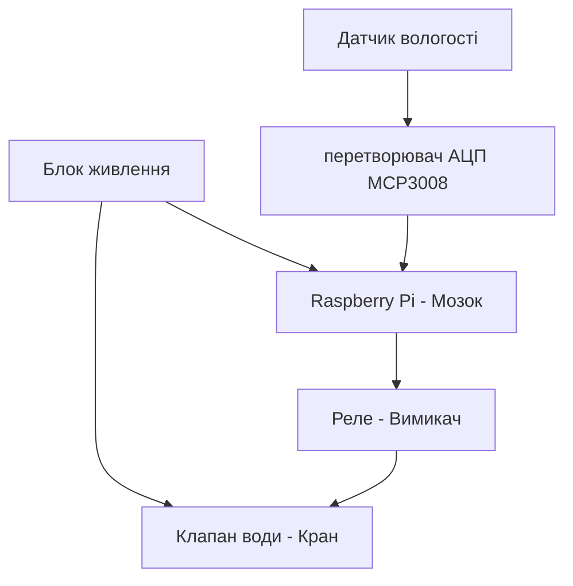

# Курсова робота

## Тема: Контроль поливом

Коваленко Михайло

 Група КС-1-2
 
 # Вступ 

Сучасний світ вимагає все більшої автоматизації та інтелектуального управління ресурсами, особливо в таких галузях, як сільське господарство, ландшафтний дизайн та домашнє садівництво. Одним із ключових аспектів ефективного вирощування рослин є підтримка оптимального рівня вологості ґрунту, що безпосередньо впливає на їхній ріст і розвиток. Традиційний ручний полив часто є недостатньо точним, надмірним або, навпаки, недостатнім, що призводить до втрат води та погіршення стану рослин. У зв’язку з цим актуальним є створення розумних систем автоматичного поливу, здатних аналізувати стан ґрунту та навколишнього середовища та приймати обґрунтовані рішення щодо поливу в реальному часі.

Метою даного проекту є розробка та реалізація автоматизованої системи поливу на базі мікрокомп’ютера Raspberry Pi, яка забезпечує точне вимірювання вологості ґрунту та параметрів навколишнього середовища,автономне прийняття рішень та дистанційне керування через Wi-Fi. Особливістю системи є використання сучасних датчиків, зокрема ємнісного датчика вологості ґрунту, що виключає проблему корозії, а також реалізація Edge-обчислення з можливістю подальшої інтеграції з хмарними сервісами.

Проект передбачає комплексний підхід до побудови IoT-системи: від вибору апаратного забезпечення та підключення датчиків до реалізації програмної логіки, підтримки мережевих протоколів (MQTT, HTTP), створення інтерфейсу та налаштування автоматичних повідомлень через Discord. Усе це дозволяє створити надійну, автономну та розширювану систему, придатну для використання як в побутових, так і в промислових умовах.

Розроблена система не лише оптимізує витрати води, але й забезпечує безперебійну роботу навіть при відсутності інтернет-з’єднання, завдяки локальній обробці даних на рівні Edge. Це робить її стійкою до збоїв зв’язку та придатною для використання в умовах, де зв’язок із хмарою є нестабільним.

У подальшому в роботі наведено детальний опис апаратної та програмної реалізації проекту, архітектури системи, принципів роботи датчиків, механізмів збору, зберігання та передачі даних, а також шляхів інтеграції з користувацькими інтерфейсами та зовнішніми сервісами.

 
 ---
 ## Основні ідеї проєкту 
### Основні завдання проєкту:

1. Дослідити принцип роботи та виконати опис датчика вологості ґрунту.
2. Реалізувати збір, обробку та відображення даних на Edge-рівні.
3. Налаштувати передачу даних за допомогою MQTT та HTTP.
4. Створити веб-інтерфейс для моніторингу параметрів системи.
5. Реалізувати систему автоматичних сповіщень через Discord.

  

## РОЗДІЛ 1. ЗАГАЛЬНА ХАРАКТЕРИСТИКА СИСТЕМИ АВТОМАТИЗОВАНОГО КОНТРОЛЮ ПОЛИВОМ
### 1.1 Суть та призначення системи
Система автоматизованого контролю поливом призначена для підтримання оптимального рівня вологості ґрунту в саду без участі людини. Основна ідея полягає в тому, що датчики постійно стежать за станом ґрунту та погодними умовами, а при падінні вологості нижче допустимого рівня — система самостійно вмикає полив і вимикає його після досягнення потрібного показника.
Система вирішує три ключові задачі:

Моніторинг — безперервне зчитування вологості ґрунту та температури/вологості повітря;
Управління — автоматичне вмикання та вимикання поливу за алгоритмом;
Інформування — передача даних у хмару та сповіщення користувача через месенджер.

### 1.2 Апаратний склад системи
Система побудована на базі Raspberry Pi як центрального керуючого модуля. Він обрано з огляду на достатню обчислювальну потужність для Edge-обробки даних, підтримку повноцінної ОС Linux, мережевих сервісів та інтерфейсів SPI і GPIO для підключення периферійних пристроїв.
До складу системи входять такі пристрої:

Capacitive Soil Moisture Sensor v1.2 — ємнісний датчик вологості ґрунту. На відміну від резистивних аналогів, його контакти покриті лаком і не контактують із водою, що виключає корозію та забезпечує тривалу роботу в землі. Датчик видає аналоговий сигнал напруги.
MCP3008 — 10-бітний аналогово-цифровий перетворювач (АЦП), що підключається до Raspberry Pi по протоколу SPI. Необхідний тому, що Raspberry Pi не має власних аналогових входів і не може безпосередньо зчитати сигнал з ємнісного датчика — MCP3008 перетворює аналогову напругу в цифровий код.
DHT22 (AM2302) — цифровий датчик температури та вологості повітря. Забезпечує точність вимірювання ±0.5°C по температурі та ±2% по вологості. Передає дані по однопровідному цифровому протоколу напряму на GPIO Raspberry Pi, не використовуючи канали АЦП.
Модуль реле + електромагнітний клапан — виконавчий механізм системи. Оскільки GPIO Raspberry Pi видає лише 3.3V, а електромагнітний клапан потребує зовнішньої напруги 12V, модуль реле виконує роль ізольованого «вимикача»: він отримує сигнал керування від Raspberry Pi і комутує силове живлення клапана.

### 1.3 Принцип роботи системи
Система працює циклічно за таким принципом:

MCP3008 зчитує аналоговий сигнал з датчика вологості ґрунту і передає цифрове значення на Raspberry Pi по SPI.
DHT22 передає показання температури та вологості повітря напряму на GPIO Raspberry Pi.
Raspberry Pi обробляє отримані дані та порівнює поточний рівень вологості ґрунту з установленими пороговими значеннями.
Якщо вологість нижче нижнього порогу — Raspberry Pi подає сигнал на модуль реле, яке відкриває електромагнітний клапан і починається полив.
Якщо вологість досягла верхнього порогу — реле отримує команду закрити клапан і полив зупиняється.
Дані передаються до хмарної платформи через протокол MQTT.
При важливих подіях (початок/кінець поливу, критична вологість, помилка датчика) система надсилає сповіщення в Discord.

Цей цикл повторюється безперервно, забезпечуючи повністю автономну роботу системи.

### 1.4 Архітектура системи
Система побудована за трирівневою IoT-архітектурою:
Edge-рівень (пристрій) — Raspberry Pi з підключеними датчиками та клапаном. Тут відбувається збір і обробка даних, аналіз отриманої інформації та керування процесом поливу Система здатна працювати автономно навіть без підключення до Інтернету.
Fog-рівень (мережа) — Raspberry Pi підключається до домашньої WiFi-мережі та виступає як локальний сервер. Користувач може підключитися зі смартфону через браузер, бачити поточний стан системи, переглядати архів і керувати поливом вручну.
Cloud-рівень (хмара) — передбачає можливість подальшого підключення зовнішніх сервісів через MQTT для зберігання статистики та розширення функціональності системи.

### 1.5 Взаємодія користувача з системою
Користувач може взаємодіяти з системою трьома способами:

Через браузер смартфону — відкривши IP-адресу Raspberry Pi у WiFi-мережі, можна переглядати поточну вологість ґрунту, температуру повітря, стан клапана та керувати поливом вручну;
Через Discord — отримання автоматичних сповіщень про початок або завершення поливу, критичне зниження вологості чи виникнення несправностей.

### 1.6 Висновок
Система є замкнутим автоматизованим циклом: датчики → Raspberry Pi → клапан → хмара → користувач. Поєднання ємнісного датчика ґрунту, АЦП MCP3008, датчика погоди DHT22 та електромагнітного клапана під керуванням Raspberry Pi забезпечує надійний і точний контроль поливу, що не потребує постійної уваги — садівник отримує лише важливі сповіщення, а вся рутинна робота виконується автоматично.

  

## Розділ 2. Пошук та вибір апаратного забезпечення і розробка архітектури та необхідної проєктної документації

Для реалізації автоматизованої системи поливу було проаналізовано ринок компонентів та обрано наступний комплекс технічних засобів.
Усі рішення, які стосуються вибору технічних та програмних компонентів та їх взаємодії, описуються саме в цьому розділі.
### 2.1
1. Керуючий модуль: Raspberry Pi
   * *Обґрунтування*: Забезпечує високу обчислювальну потужність для Edge-обробки даних, підтримує повноцінну ОС Linux та широкий набір мережевих і програмних сервісів. Має вбудовані інтерфейси SPI та GPIO для роботи з периферією.

2. Датчик вологості ґрунту: Capacitive Soil Moisture Sensor v1.2
   * *Обґрунтування*: На відміну від дешевих резистивних датчиків, цей датчик є ємнісним. Його контакти покриті лаком і не контактують із водою напряму, що повністю виключає корозію (іржавіння) та забезпечує довговічність роботи в землі.

3. Аналогово-цифровий перетворювач (АЦП): MCP3008
   * *Обґрунтування*: Оскільки Raspberry Pi не має власних вбудованих аналогових входів (розуміє лише цифровий сигнал "0" або "1"), для зчитування точних значень напруги з ємнісного датчика ґрунту обрано 10-бітний 8-канальний АЦП MCP3008, який працює по надійному протоколу SPI.

4. Датчик погоди: DHT22 (AM2302)
   * *Обґрунтування*: Має вищу точність вимірювання температури (±0.5°C) та вологості повітря (±2%), а також ширший діапазон вимірювань, ніж аналог DHT11. Передає дані по цифровому однопровідному протоколу, не займаючи канали АЦП.

5. Виконавчі пристрої: Модуль реле та Електромагнітний клапан води
   * *Обґрунтування*: Електромагнітний клапан працює від зовнішньої напруги (зазвичай 12V), тоді як GPIO Raspberry Pi видає лише 3.3V. Модуль реле служить безпечним ізольованим «вимикачем», який дозволяє мікрокомп'ютеру керувати потужним силовим навантаженням (відкриттям/закриттям крану).

### 2.2 Розроблення структурної схеми

Опис роботи структурної схеми:
Система працює автоматично. Датчики вологості ґрунту та погоди (DHT22) передають дані на Raspberry Pi. Оскільки датчик ґрунту аналоговий, сигнал проходить через перетворювач АЦП MCP3008. Якщо земля суха, Raspberry Pi через модуль реле відкриває електромагнітний клапан і вмикає полив.

### 2.3 Опис та підключення датчиків

У моїй курсові роботі я обрав  ємнісний датчик вологості ґрунту Capacitive Soil Moisture Sensor v1.2.

### Принцип роботи датчика:
Датчик вимірює діелектричну проникність ґрунту за допомогою ємнісного вимірювання, що безпосередньо залежить від кількості вологи в землі. На відміну від дешевих резистивних датчиків, цей модуль не має відкритих металевих контактів на щупі, тому він не буде іржавіти в землі, тому прослужить набагато довше в умовах постійної вологості.

### Підключення до Raspberry Pi:
Оскільки датчик видає аналоговий сигнал (напругу, яка змінюється залежно від сухості землі), а Raspberry Pi не має власних аналогових входів (GPIO розуміють тільки "0" або "1"), підключення виконується через аналогово-цифровий перетворювач (АЦП) MCP3008 за такою схемою:

1. Датчик вологості ґрунту ➔ АЦП MCP3008:
   * VCC (живлення) ➔ 3.3V або 5V
   * GND (земля) ➔ GND
   * AOUT (аналоговий вихід) ➔ до аналогового каналу CH0 на мікросхемі MCP3008.

2. АЦП MCP3008 ➔ Raspberry Pi (через інтерфейс SPI):
   * VDD/VREF ➔ 3.3V на Raspberry Pi
   * AGND/DGND ➔ GND на Raspberry Pi
   * CLK (тактування) ➔ GPIO 11 (SCLK)
   * DOUT (вихід даних) ➔ GPIO 9 (MISO)
   * DIN (вхід даних) ➔ GPIO 10 (MOSI)
   * CS/SHDN (вибір мікросхеми) ➔ GPIO 8 (CE0)

Для створення картинки був використаний штучний інтелект

### 2.4 Архівування даних на Edge-рівні

Архівування та відображення даних на Edge-рівні

Для контролю роботи системи використовується накопичення та відображення поточних даних у середовищі Node-RED. Значення вологості ґрунту та температури передаються на інформаційну панель Dashboard, де відображаються у вигляді графіків та індикаторів.
Такий підхід дозволяє в режимі реального часу спостерігати за зміною параметрів системи, контролювати роботу алгоритму автоматичного поливу та аналізувати поточний стан об'єкта керування.
Для передачі даних між окремими вузлами використовується протокол MQTT, що забезпечує швидкий обмін повідомленнями та можливість подальшої інтеграції з іншими IoT-рішеннями.

### 2.5. Технічна структура системи
Проєкт системи контролю поливу в саду побудований на базі мікрокомп'ютера Raspberry Pi, який виступає в ролі Edge-вузла. Оскільки плата Raspberry Pi не має вбудованих аналогових входів (GPIO розуміють тільки "0" або "1"), для зняття показників з аналогового датчика вологості ґрунту використовується аналогово-цифровий перетворювач (АЦП) MCP3008.

Зв'язок між компонентами реалізовано наступним чином:
* Датчик вологості фіксує стан ґрунту та передає аналоговий сигнал на АЦП.
* АЦП MCP3008 оцифровує отримані дані та через інтерфейс SPI передає їх на шину мікрокомп'ютера Raspberry Pi для подальшого аналізу.

### 2.6. Відомість та опис апаратних засобів

Таблиця 2.2. Відомість апаратних засобів

| Найменування | Кількість | Опис | Примітка |
| :--- | :--- | :--- | :--- |
| Raspberry Pi | 1 | [Опис та характеристики платформи Raspberry Pi](https://raspberrypi.com) | Головний контролер системи автоматизації |
| АЦП MCP3008 | 1 | [Специфікація мікросхеми MCP3008 SPI ADC](https://microchip.com) | 10-бітний аналогово-цифровий перетворювач |
| Датчик вологості ґрунту | 1 | [Аналоговий сенсор визначення вологості](https://arduino.ua) | Вимірювання рівня вологості в саду |
| Дроти Dupont | 10 | Сполучні кабелі типу мама-мама / мама-тато | Для комутації елементів системи |

#### Опис обраних технічних засобів

Датчик вологості ґрунту — це ємнісний сенсор, призначений для визначення рівня вологи у ґрунті.

### 2.7. Програмна структура системи
Для реалізації програмної логіки системи використовується середовище Node-RED. У ньому реалізовано генерацію тестових даних, обробку телеметрії, передачу повідомлень через MQTT, роботу алгоритму автоматичного поливу та відображення інформації на Dashboard.

Як організовано збереження даних:
Програмна структура системи побудована на використанні потоків Node-RED, які забезпечують генерацію тестових даних, обробку телеметрії, передачу повідомлень через MQTT, відображення інформації на Dashboard та роботу алгоритму автоматичного поливу.

## РОЗДІЛ 3. МЕТОДИКА ПЕРЕВІРКИ ТА ЗАСОБИ ТЕСТУВАННЯ

Перед введенням системи автоматичного поливу в експлуатацію необхідно перевірити правильність роботи всіх її компонентів. Тестування дозволяє переконатися, що дані з датчиків обробляються коректно, алгоритми працюють без помилок, а користувач отримує актуальну інформацію про стан системи. Для цього проводиться поетапна перевірка окремих функцій та всієї системи в цілому.

Оскільки під час розробки не завжди є можливість використовувати реальне обладнання, у проєкті передбачений режим імітації. Він дозволяє тестувати алгоритми роботи системи без підключення фізичних датчиків, АЦП та електромагнітного клапана.

### 3.1 Методика перевірки підсистеми Edge-рівня

Перевірка підсистеми Edge-рівня виконується за такими напрямками:

* перевірка функцій вводу та виводу даних;
* перевірка веб-інтерфейсу користувача;
* перевірка системи сповіщень.

### 3.1.1 Перевірка функцій вводу та виводу

Для перевірки роботи системи виконуються такі дії:

Запускається потік Node-RED.
Вузол «Оновлення кожні 7 сек» генерує запуск системи.
Вузол «Емуляція датчиків» формує тестові значення вологості та температури.
Перевіряється відображення даних у вузлах Debug.
Контролюється передача даних через MQTT.
Перевіряється коректність оновлення Dashboard.
Перевіряється робота алгоритму автоматичного поливу.

### 3.1.2 Перевірка функцій відображення

Для перевірки Dashboard виконуються такі дії:

Запускається Node-RED Dashboard.
Перевіряється відображення поточного значення вологості.
Перевіряється відображення поточного значення температури.
Контролюється оновлення індикатора стану клапана.
Перевіряється побудова графіка вологості.
Перевіряється побудова графіка температури.
Контролюється оновлення показників після кожного циклу емуляції.

### 3.1.3 Перевірка системи сповіщень Discord

Для перевірки роботи системи сповіщень виконуються такі дії:

Штучно зменшується значення вологості.
Перевіряється спрацювання вузла «Автополив».
Контролюється зміна стану клапана.
Формується повідомлення про запуск поливу.
Через вузол HTTP Request повідомлення передається до Discord.
Перевіряється отримання повідомлення в каналі Discord.

Після завершення всіх етапів тестування робиться висновок про працездатність системи автоматичного поливу та її готовність до використання в реальних умовах.

## РОЗДІЛ 4. РОЗРОБКА ТА НАЛАГОДЖЕННЯ ПРОГРАМНОГО ЗАБЕЗПЕЧЕННЯ ТА СУПРОВІДНОЇ ДОКУМЕНТАЦІЇ

У цьому розділі наведено детальний опис розробленого програмного забезпечення для автоматизованої системи садового поливу, архітектуру програмних модулів, логіку обміну даними та принципи побудови користувацьких інтерфейсів.

### 4.1. ПЗ для Edge-рівня
Програмне забезпечення системи реалізоване у середовищі Node-RED, яке забезпечує візуальне програмування алгоритмів та потоків обробки даних. Обрання цього середовища обумовлене простотою розробки та зручністю побудови інформаційних зв'язків між окремими компонентами системи. Використання візуального програмування дозволяє швидко вносити зміни до структури проєкту, здійснювати налагодження роботи окремих вузлів та контролювати процес передачі даних у режимі реального часу.

Для перевірки працездатності системи використовується режим емуляції датчиків. Генерація нових значень відбувається автоматично кожні 7 секунд за допомогою вузла «Оновлення кожні 7 сек». Далі вузол «Емуляція датчиків» формує значення вологості ґрунту та температури повітря, які використовуються для тестування алгоритмів керування поливом без застосування фізичних сенсорів.

Сформовані дані надходять до вузла «Розділення телеметрії», який виконує їх розподіл між окремими підсистемами. Отримані значення передаються на інформаційну панель Dashboard для візуалізації, публікуються через MQTT та використовуються модулем автоматичного поливу.

Алгоритм автоматичного керування реалізовано у вузлі «Автополив». Під час роботи він аналізує поточний рівень вологості ґрунту та визначає необхідність активації або вимкнення поливу. Результат роботи алгоритму відображається у вигляді поточного стану клапана на панелі керування.

Для контролю та налагодження роботи системи використовується вузол Debug, який дозволяє відстежувати повідомлення, що проходять між окремими модулями, та перевіряти правильність функціонування всієї логіки керування.

Рисунок 4.1 – Потік Node-RED системи автоматичного поливу.

### 4.2. Схеми інформаційної взаємодії

Обмін інформацією в системі побудований за принципом послідовної обробки телеметричних даних.

Початковим етапом є формування показників вологості ґрунту та температури повітря у вузлі емуляції. Згенеровані значення передаються до вузла розподілу телеметрії, який виконує маршрутизацію інформації між окремими підсистемами.

Одна частина даних надходить до MQTT-вузлів для подальшої передачі через мережу. Для кожного параметра використовується окремий MQTT-топік:

* вологість ґрунту;
* температура повітря;
* стан клапана.

Інша частина даних передається до Dashboard Node-RED, де забезпечується їх відображення у вигляді цифрових індикаторів та графіків.

Паралельно інформація про вологість ґрунту надходить до вузла автоматичного поливу. Після аналізу поточних показників формується рішення щодо стану системи поливу. Отриманий результат використовується для оновлення індикатора стану клапана та формування повідомлень про події.

У випадку зміни стану поливу спеціальний вузол формує текст повідомлення, яке через HTTP Request надсилається до сервісу Discord. Завдяки цьому користувач отримує оперативне сповіщення про роботу системи.

Таким чином забезпечується одночасне виконання трьох основних функцій:

* моніторинг параметрів;
* автоматичне керування поливом;
* інформування користувача.

Рисунок 4.2 – Схема інформаційної взаємодії модулів.

### 4.3 Передача даних та система сповіщень

Для передачі інформації за межі локального вузла використовується протокол MQTT та сервіс Discord.

## MQTT

MQTT використовується як основний механізм обміну телеметричними даними. Після обробки значень вологості та температури система автоматично публікує їх у відповідні MQTT-топіки.

Застосування MQTT забезпечує:

* низьке навантаження на мережу;
* високу швидкість передачі повідомлень;
* можливість інтеграції з іншими IoT-системами;
* масштабованість проєкту.

Передача даних здійснюється окремо для кожного параметра системи, що спрощує їх подальшу обробку та аналіз.

## Discord

Для реалізації системи сповіщень використовується Discord Webhook.

При виникненні важливих подій система автоматично формує повідомлення та надсилає його через HTTP-запит до Discord-каналу.

До подій, про які може бути повідомлено користувача, належать:

* запуск автоматичного поливу;
* вимкнення поливу;
* зміна стану клапана;
* критичне зниження вологості ґрунту.

Використання Discord дозволяє оперативно контролювати роботу системи з будь-якого пристрою, що має доступ до мережі Інтернет.

### 4.4. WEB-інтерфейси (локальний для Edge та глобальний)

Для взаємодії користувача із системою використовується веб-інтерфейс, створений за допомогою Node-RED Dashboard.

4.4.1 Локальний WEB-інтерфейс (Edge Dashboard)

Локальний інтерфейс забезпечує відображення поточного стану системи в режимі реального часу.

На інформаційній панелі відображаються:

* поточна вологість ґрунту;
* поточна температура повітря;
* стан клапана поливу;
* графік зміни вологості;
* графік зміни температури.

Індикатори автоматично оновлюються після надходження нових даних від вузла емуляції. Це дозволяє користувачу спостерігати за роботою системи без перезавантаження сторінки.

Графіки забезпечують наочне відображення динаміки зміни параметрів та дозволяють оцінити роботу алгоритму автоматичного поливу протягом тривалого часу.

Рисунок 4.3 – Відображення стану клапана.

Рисунок 4.4 – Dashboard моніторингу температури.

Рисунок 4.5 – Dashboard моніторингу вологості ґрунту

### 4.4.2. Віддалений доступ до системи

Віддалений доступ до даних реалізовано через мережеві сервіси MQTT та Discord.

MQTT забезпечує можливість підключення зовнішніх клієнтів для перегляду телеметрії системи, а Discord дозволяє отримувати повідомлення про події незалежно від місця перебування користувача.

Завдяки цьому користувач може контролювати роботу системи не лише в локальній мережі, але й дистанційно через Інтернет.

Реалізована архітектура забезпечує просте масштабування системи та можливість подальшого підключення додаткових датчиків, виконавчих механізмів і хмарних сервісів без суттєвої зміни програмної структури проєкту.

Рисунок 4.6 – Повідомлення системи у Discord.

Код до Node-red знаходиться в папці flows.json

## Розділ 5.  Використані джерела 

Використані джерела: 

 1.Raspberry Pi Documentation — офіційна документація Raspberry Pi, опис GPIO, SPI, налаштування мережі та операційної системи.
 
 2.Node-RED Official Documentation — документація середовища Node-RED.
 
 3.Wikipedia Україна — Інтернет речей (IoT) — загальні відомості про архітектуру IoT-систем.
 
 4.Пупена, О. М. Довідник з розробки застосунків у середовищі NODE-RED [Електронний ресурс] : електронний довідник/О. М. Пупена; Національний університет харчових технологій. – Київ : НУХТ, 2021. – 170 с. – № 100.115

 5.Discord Developer Documentation. Webhooks Documentation.

