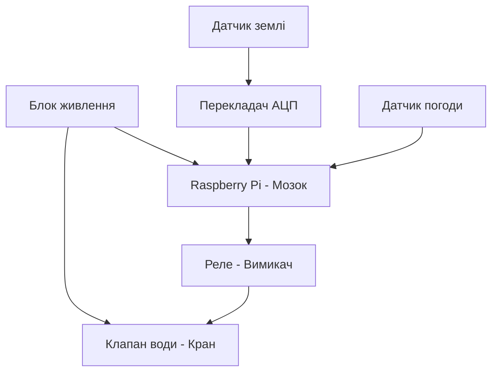

# Курсова робота

## Тема: Контроль поливом

Коваленко Михайло

 Група КС-1-2
 
 ---
 ## Основні ідеї проєкту (завдання) 
 **Опис та підключення датчика:** один датчик згідно з варіантом.
 
  Опис таведення архіву даних на Edge-рівні. 
  
  Опис та підклюінтерфейс для підключення та керування з телефону через WiFi.

   датчика:** один датчиреалізація протоколів MQTT, WebSocket та HTTP.

  
 та підключення розробка та впровадження одного основного алгоритму реалізації:** одизбір та відображення статистики в хмарі.
  
  
  **Опис та підключналаштування автоматичних повідомлень через Discord або Telegram.

## 4. Розроблення структурної схеми

Опис роботи структурної схеми:
Система працює автоматично. Датчики вологості ґрунту та погоди (DHT22) передають дані на Raspberry Pi. Оскільки датчик ґрунту аналоговий, сигнал проходить через перетворювач АЦП MCP3008. Якщо земля суха, Raspberry Pi через модуль реле відкриває електромагнітний клапан і вмикає полив.

