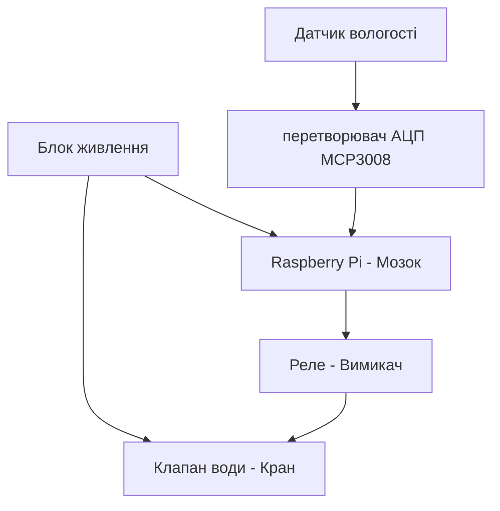

## Розділ 2. Пошук та вибір апаратного забезпечення і розробка архітектури та необхідної проєктної документації

Для реалізації автоматизованої системи поливу було проаналізовано ринок компонентів та обрано наступний комплекс технічних засобів.
Усі рішення, які стосуються вибору технічних та програмних компонентів та їх взаємодії, описуються саме в цьому розділі.
### 2.1
1. Керуючий модуль: Raspberry Pi
   * *Обґрунтування*: Забезпечує високу обчислювальну потужність для Edge-обробки даних, підтримує повноцінну ОС Linux та широкий набір мережевих і програмних сервісів. Має вбудовані інтерфейси SPI та GPIO для роботи з периферією.

2. Датчик вологості ґрунту: Capacitive Soil Moisture Sensor v1.2
   * *Обґрунтування*: На відміну від дешевих резистивних датчиків, цей датчик є ємнісним. Його контакти покриті лаком і не контактують із водою напряму, що повністю виключає корозію (іржавіння) та забезпечує довговічність роботи в землі.

3. Аналогово-цифровий перетворювач (АЦП): MCP3008
   * *Обґрунтування*: Оскільки Raspberry Pi не має власних вбудованих аналогових входів (розуміє лише цифровий сигнал "0" або "1"), для зчитування точних значень напруги з ємнісного датчика ґрунту обрано 10-бітний 8-канальний АЦП MCP3008, який працює по надійному протоколу SPI.

4. Датчик погоди: DHT22 (AM2302)
   * *Обґрунтування*: Має вищу точність вимірювання температури (±0.5°C) та вологості повітря (±2%), а також ширший діапазон вимірювань, ніж аналог DHT11. Передає дані по цифровому однопровідному протоколу, не займаючи канали АЦП.

5. Виконавчі пристрої: Модуль реле та Електромагнітний клапан води
   * *Обґрунтування*: Електромагнітний клапан працює від зовнішньої напруги (зазвичай 12V), тоді як GPIO Raspberry Pi видає лише 3.3V. Модуль реле служить безпечним ізольованим «вимикачем», який дозволяє мікрокомп'ютеру керувати потужним силовим навантаженням (відкриттям/закриттям крану).

### 2.2 Розроблення структурної схеми

Опис роботи структурної схеми:
Система працює автоматично. Датчики вологості ґрунту та погоди (DHT22) передають дані на Raspberry Pi. Оскільки датчик ґрунту аналоговий, сигнал проходить через перетворювач АЦП MCP3008. Якщо земля суха, Raspberry Pi через модуль реле відкриває електромагнітний клапан і вмикає полив.

### 2.3 Опис та підключення датчиків

У моїй курсові роботі я обрав  ємнісний датчик вологості ґрунту Capacitive Soil Moisture Sensor v1.2.

### Принцип роботи датчика:
Датчик вимірює діелектричну проникність ґрунту за допомогою ємнісного вимірювання, що безпосередньо залежить від кількості вологи в землі. На відміну від дешевих резистивних датчиків, цей модуль не має відкритих металевих контактів на щупі, тому він не буде іржавіти в землі, тому прослужить набагато довше в умовах постійної вологості.

### Підключення до Raspberry Pi:
Оскільки датчик видає аналоговий сигнал (напругу, яка змінюється залежно від сухості землі), а Raspberry Pi не має власних аналогових входів (GPIO розуміють тільки "0" або "1"), підключення виконується через аналогово-цифровий перетворювач (АЦП) MCP3008 за такою схемою:

1. Датчик вологості ґрунту ➔ АЦП MCP3008:
   * VCC (живлення) ➔ 3.3V або 5V
   * GND (земля) ➔ GND
   * AOUT (аналоговий вихід) ➔ до аналогового каналу CH0 на мікросхемі MCP3008.

2. АЦП MCP3008 ➔ Raspberry Pi (через інтерфейс SPI):
   * VDD/VREF ➔ 3.3V на Raspberry Pi
   * AGND/DGND ➔ GND на Raspberry Pi
   * CLK (тактування) ➔ GPIO 11 (SCLK)
   * DOUT (вихід даних) ➔ GPIO 9 (MISO)
   * DIN (вхід даних) ➔ GPIO 10 (MOSI)
   * CS/SHDN (вибір мікросхеми) ➔ GPIO 8 (CE0)

Для створення картинки був використаний штучний інтелект

### 2.4 Архівування даних на Edge-рівні

Архівування та відображення даних на Edge-рівні

Для контролю роботи системи використовується накопичення та відображення поточних даних у середовищі Node-RED. Значення вологості ґрунту та температури передаються на інформаційну панель Dashboard, де відображаються у вигляді графіків та індикаторів.
Такий підхід дозволяє в режимі реального часу спостерігати за зміною параметрів системи, контролювати роботу алгоритму автоматичного поливу та аналізувати поточний стан об'єкта керування.
Для передачі даних між окремими вузлами використовується протокол MQTT, що забезпечує швидкий обмін повідомленнями та можливість подальшої інтеграції з іншими IoT-рішеннями.

### 2.5. Технічна структура системи
Проєкт системи контролю поливу в саду побудований на базі мікрокомп'ютера Raspberry Pi, який виступає в ролі Edge-вузла. Оскільки плата Raspberry Pi не має вбудованих аналогових входів (GPIO розуміють тільки "0" або "1"), для зняття показників з аналогового датчика вологості ґрунту використовується аналогово-цифровий перетворювач (АЦП) MCP3008.

Зв'язок між компонентами реалізовано наступним чином:
* Датчик вологості фіксує стан ґрунту та передає аналоговий сигнал на АЦП.
* АЦП MCP3008 оцифровує отримані дані та через інтерфейс SPI передає їх на шину мікрокомп'ютера Raspberry Pi для подальшого аналізу.

### 2.6. Відомість та опис апаратних засобів

Таблиця 2.2. Відомість апаратних засобів

| Найменування | Кількість | Опис | Примітка |
| :--- | :--- | :--- | :--- |
| Raspberry Pi | 1 | [Опис та характеристики платформи Raspberry Pi](https://raspberrypi.com) | Головний контролер системи автоматизації |
| АЦП MCP3008 | 1 | [Специфікація мікросхеми MCP3008 SPI ADC](https://microchip.com) | 10-бітний аналогово-цифровий перетворювач |
| Датчик вологості ґрунту | 1 | [Аналоговий сенсор визначення вологості](https://arduino.ua) | Вимірювання рівня вологості в саду |
| Дроти Dupont | 10 | Сполучні кабелі типу мама-мама / мама-тато | Для комутації елементів системи |

#### Опис обраних технічних засобів

Датчик вологості ґрунту — це ємнісний сенсор, призначений для визначення рівня вологи у ґрунті.

### 2.7. Програмна структура системи
Для реалізації програмної логіки системи використовується середовище Node-RED. У ньому реалізовано генерацію тестових даних, обробку телеметрії, передачу повідомлень через MQTT, роботу алгоритму автоматичного поливу та відображення інформації на Dashboard.

Як організовано збереження даних:
Програмна структура системи побудована на використанні потоків Node-RED, які забезпечують генерацію тестових даних, обробку телеметрії, передачу повідомлень через MQTT, відображення інформації на Dashboard та роботу алгоритму автоматичного поливу.
