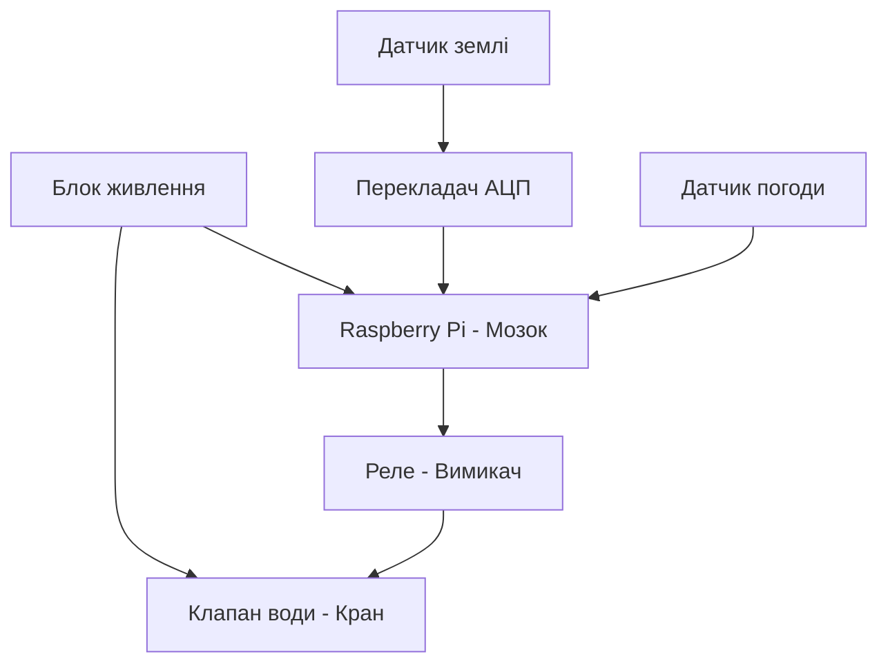

# Курсова робота

## Тема: Контроль поливом

Коваленко Михайло

 Група КС-1-2
 
 # Вступ 

Сучасний світ вимагає все більшої автоматизації та інтелектуального управління ресурсами, особливо в таких галузях, як сільське господарство, ландшафтний дизайн та домашнє садівництво. Одним із ключових аспектів ефективного вирощування рослин є підтримка оптимального рівня вологості ґрунту, що безпосередньо впливає на їхній ріст і розвиток. Традиційний ручний полив часто є недостатньо точним, надмірним або, навпаки, недостатнім, що призводить до втрат води та погіршення стану рослин. У зв’язку з цим актуальним є створення розумних систем автоматичного поливу, здатних аналізувати стан ґрунту та навколишнього середовища та приймати обґрунтовані рішення щодо поливу в реальному часі.

Метою даного проекту є розробка та реалізація автоматизованої системи поливу на базі мікрокомп’ютера Raspberry Pi, яка забезпечує точне вимірювання вологості ґрунту та параметрів навколишнього середовища, локальне архівування даних, автономне прийняття рішень та дистанційне керування через WiFi. Особливістю системи є використання сучасних датчиків, зокрема ємнісного датчика вологості ґрунту, що виключає проблему корозії, а також реалізація Edge-обчислення з можливістю подальшої інтеграції з хмарними сервісами.

Проект передбачає комплексний підхід до побудови IoT-системи: від вибору апаратного забезпечення та підключення датчиків до реалізації програмної логіки, підтримки мережевих протоколів (MQTT, WebSocket, HTTP), організації локального архіву даних у SQLite, створення інтерфейсу для керування з мобільного пристрою та налаштування автоматичних повідомлень через Telegram або Discord. Усе це дозволяє створити надійну, автономну та розширювану систему, придатну для використання як в побутових, так і в промислових умовах.

Розроблена система не лише оптимізує витрати води, але й забезпечує безперебійну роботу навіть при відсутності інтернет-з’єднання, завдяки локальній обробці даних на рівні Edge. Це робить її стійкою до збоїв зв’язку та придатною для використання в умовах, де зв’язок із хмарою є нестабільним.

У подальшому в роботі наведено детальний опис апаратної та програмної реалізації проекту, архітектури системи, принципів роботи датчиків, механізмів збору, зберігання та передачі даних, а також шляхів інтеграції з користувацькими інтерфейсами та зовнішніми сервісами.

 
 ---
 ## Основні ідеї проєкту (завдання) 
 **Опис та підключення датчика:** один датчик згідно з варіантом.
 
  Опис таведення архіву даних на Edge-рівні. 
  
  Опис та підклюінтерфейс для підключення та керування з телефону через WiFi.

   датчика: один датчиреалізація протоколів MQTT, WebSocket та HTTP.

  
 та підключення розробка та впровадження одного основного алгоритму реалізації: одизбір та відображення статистики в хмарі.
  
  
  Опис та підключналаштування автоматичних повідомлень через Discord або Telegram.

### 1. Пошук та вибір апаратного забезпечення

Для реалізації автоматизованої системи поливу було проаналізовано ринок компонентів та обрано наступний комплекс технічних засобів:

1. Керуючий модуль: Raspberry Pi
   * *Обґрунтування*: Забезпечує високу обчислювальну потужність для Edge-обробки даних, підтримує повноцінну ОС Linux та локальну СКБД SQLite. Має вбудовані інтерфейси SPI та GPIO для роботи з периферією.

2. Датчик вологості ґрунту: Capacitive Soil Moisture Sensor v1.2
   * *Обґрунтування*: На відміну від дешевих резистивних датчиків, цей датчик є ємнісним. Його контакти покриті лаком і не контактують із водою напряму, що повністю виключає корозію (іржавіння) та забезпечує довговічність роботи в землі.

3. Аналогово-цифровий перетворювач (АЦП): MCP3008
   * *Обґрунтування*: Оскільки Raspberry Pi не має власних вбудованих аналогових входів (розуміє лише цифровий сигнал "0" або "1"), для зчитування точних значень напруги з ємнісного датчика ґрунту обрано 10-бітний 8-канальний АЦП MCP3008, який працює по надійному протоколу SPI.

4. Датчик погоди: DHT22 (AM2302)
   * *Обґрунтування*: Має вищу точність вимірювання температури (±0.5°C) та вологості повітря (±2%), а також ширший діапазон вимірювань, ніж аналог DHT11. Передає дані по цифровому однопровідному протоколу, не займаючи канали АЦП.

5. Виконавчі пристрої: Модуль реле та Електромагнітний клапан води
   * *Обґрунтування*: Електромагнітний клапан працює від зовнішньої напруги (зазвичай 12V), тоді як GPIO Raspberry Pi видає лише 3.3V. Модуль реле служить безпечним ізольованим «вимикачем», який дозволяє мікрокомп'ютеру керувати потужним силовим навантаженням (відкриттям/закриттям крану).

## 1.2 Розроблення структурної схеми

Опис роботи структурної схеми:
Система працює автоматично. Датчики вологості ґрунту та погоди (DHT22) передають дані на Raspberry Pi. Оскільки датчик ґрунту аналоговий, сигнал проходить через перетворювач АЦП MCP3008. Якщо земля суха, Raspberry Pi через модуль реле відкриває електромагнітний клапан і вмикає полив.

## 1.3 Опис та підключення датчиків

У моїй курсові роботі я обрав  ємнісний датчик вологості ґрунту Capacitive Soil Moisture Sensor v1.2.

### Принцип роботи датчика:
Датчик вимірює діелектричну проникність ґрунту за допомогою ємнісного вимірювання, що безпосередньо залежить від кількості вологи в землі. На відміну від дешевих резистивних датчиків, цей модуль не має відкритих металевих контактів на щупі, тому він не буде іржавіти в землі, тому прослужить набагато довше в умовах постійної вологості.

### Підключення до Raspberry Pi:
Оскільки датчик видає аналоговий сигнал (напругу, яка змінюється залежно від сухості землі), а Raspberry Pi не має власних аналогових входів (GPIO розуміють тільки "0" або "1"), підключення виконується через аналогово-цифровий перетворювач (АЦП) MCP3008 за такою схемою:

1. Датчик ґрунту ➔ АЦП MCP3008:
   * VCC (живлення) ➔ 3.3V або 5V
   * GND (земля) ➔ GND
   * AOUT (аналоговий вихід) ➔ до аналогового каналу CH0 на мікросхемі MCP3008.

2. АЦП MCP3008 ➔ Raspberry Pi (через інтерфейс SPI):
   * VDD/VREF ➔ 3.3V на Raspberry Pi
   * AGND/DGND ➔ GND на Raspberry Pi
   * CLK (тактування) ➔ GPIO 11 (SCLK)
   * DOUT (вихід даних) ➔ GPIO 9 (MISO)
   * DIN (вхід даних) ➔ GPIO 10 (MOSI)
   * CS/SHDN (вибір мікросхеми) ➔ GPIO 8 (CE0)
## 1.4 Архівування даних на Edge-рівні

Щоб система поливу працювала стабільно, збір та збереження всієї історії вимірювань я вирішив робити локально. Тобто, дані про вологість землі та погоду збираються й одразу записуються на MicroSD карту самої плати Raspberry Pi.

### Як організовано збереження даних:
* Локальна база даних: Для збереження історії я використовую легку базу даних SQLite. Вона не потребує складного налаштування і працює як один файл прямо на MicroSD карті нашої плати.
* Структура архіву: Програма зчитує датчики кожні 10-15 хвилин та записує в таблицю три параметри: точний час (дата і година), рівень вологості ґрунту та температуру навколишнього середовища.
* Переваги такого підходу: Якщо в саду раптово зникне інтернет або зв'язок із сервером, система не зламається і не втратить дані. Вона продовжить збирати історію локально і зможе автономно приймати рішення про полив рослин.

## Розділ 2. Розробка архітектури та необхідної проєктної документації

Усі рішення, які стосуються вибору технічних та програмних компонентів та їх взаємодії, описуються саме в цьому розділі.

### 2.1. Технічна структура системи
Проєкт системи контролю поливу в саду побудований на базі мікрокомп'ютера Raspberry Pi, який виступає в ролі Edge-вузла. Оскільки плата Raspberry Pi не має вбудованих аналогових входів (GPIO розуміють тільки "0" або "1"), для зняття показників з аналогового датчика вологості ґрунту використовується аналогово-цифровий перетворювач (АЦП) MCP3008.

Зв'язок між компонентами реалізовано наступним чином:
* Датчик вологості фіксує стан ґрунту та передає аналоговий сигнал на АЦП.
* АЦП MCP3008 оцифровує отримані дані та через інтерфейс SPI передає їх на шину мікрокомп'ютера Raspberry Pi для подальшого аналізу.

### 2.2. Принципові схеми та схеми підключення

Напрямок передачі інформації та підключення ліній GPIO між компонентами організовано за такою схемою:

1. Датчик ґрунту - АЦП MCP3008:
* VCC (живлення) - 3.3V або 5V
* GND (земля) - GND
* AOUT (аналоговий вихід) - до аналогового каналу CH0 на мікросхемі MCP3008

2. АЦП MCP3008 - Raspberry Pi (через інтерфейс SPI):
* VDD/VREF - 3.3V на Raspberry Pi
* AGND/DGND - GND на Raspberry Pi
* CLK (тактування) - GPIO 11 (SCLK)
* DOUT (вихід даних) - GPIO 9 (MISO)
* DIN (вхід даних) - GPIO 10 (MOSI)
* CS/SHDN (вибір мікросхеми) - GPIO 8 (CE0)

### 2.3. Відомість та опис апаратних засобів

Таблиця 2.2. Відомість апаратних засобів

| Найменування | Кількість | Опис | Примітка |
| :--- | :--- | :--- | :--- |
| Raspberry Pi | 1 | [Опис та характеристики платформи Raspberry Pi](https://raspberrypi.com) | Головний контролер системи автоматизації |
| АЦП MCP3008 | 1 | [Специфікація мікросхеми MCP3008 SPI ADC](https://microchip.com) | 10-бітний аналогово-цифровий перетворювач |
| Датчик вологості ґрунту | 1 | [Аналоговий сенсор визначення вологості](https://arduino.ua) | Вимірювання рівня вологості в саду |
| Дроти Dupont | 10 | Сполучні кабелі типу мама-мама / мама-тато | Для комутації елементів системи |

#### Опис обраних технічних засобів

Датчик вологості ґрунту — це стабільний та точний резистивний або ємнісний сенсор, призначений для фіксації рівня вологи у прикореневій зоні рослин. Він видає аналоговий сигнал (напругу), яка змінюється залежно від сухості землі, що дозволяє гнучко налаштовувати пороги автоматичного включення поливу.

### 2.4. Програмна структура системи
Щоб система автоматичного поливу працювала стабільно, збір та збереження всієї історії вимірювань вирішено робити безпосередньо на Edge-рівні. 

Як організовано збереження даних:
* Локальна база даних: Для збереження історії використовується легка база даних SQLite. Вона не потребує окремого сервера, розгортається безпосередньо на MicroSD-карті плати Raspberry Pi та забезпечує високу швидкість запису та автономність системи.

## РОЗДІЛ 3. МЕТОДИКА ПЕРЕВІРКИ ТА ЗАСОБИ ТЕСТУВАННЯ

Перед тим як встановлювати розроблену систему поливу безпосередньо на садовій ділянці, потрібно обов'язково перевірити, чи правильно працює весь софт і як взаємодіють між собою блоки. Цей процес перевірки та підтвердження працездатності називають верифікацією програмного забезпечення та логіки взаємодії компонентів. Перевірка здійснюється спочатку для окремих елементів Edge-рівня (логiки Node-RED), а потім для всієї системи загалом. У даному розділі описано методику перевірки функцій керування та моніторингу саду.
Варто враховувати, що під час налагодження алгоритмів у середовищі Node-RED фізичних плат Raspberry Pi, АЦП чи датчиків може не бути під рукою. Саме тому в проекті реалізовано спеціальний тестовий режим (імітація), який дозволяє відкатати роботу системи віртуально (плата Raspberry Pi, датчики вологості, АЦП чи реальний клапан). Для цього у програмі передбачено особливий режим роботи для тестування (імітації), а в методиці описано механізм його використання.

### 3.1. Методика перевірки підсистеми Edge-рівня
Методика перевірки Edge-рівня на базі мікрокомп'ютера Raspberry Pi передбачає окрему перевірку таких функцій:
функцій вводу/виводу даних (зчитування сигналів АЦП та датчиків, керування реле);
функцій відображення та керування на локальному Веб-інтерфейсі Node-RED Dashboard;
функцій архівування в локальну базу даних SQLite.

### 3.1.1. Перевірка функцій вводу/виводу
Перевірка каналу вологості ґрунту (Capacitive v1.2 + MCP3008):  спочатку ми беремо вузол debug в Node-RED, щоб подивитися, який саме 10-бітний код приходить від АЦП MCP3008 по SPI. Далі контролюємо, чи правильно формула перераховує ці цифри у звичні відсотки вологості (від 0 до 100%) 10-бітного цифрового коду з АЦП MCP3008 по протоколу SPI та його математичний перерахунок у відсотки вологості (від 0% до 100%). Дані мають оновлюватися з періодичністю в 1 секунду.
Перевірка датчика погоди (DHT22): за допомогою налагоджувальних вузлів контролюється коректність розділення цифрового сигналу на два незалежних параметри: температура повітря (°C) та вологість повітря (%).
Перевірка каналу керування клапаном (Модуль реле): використовуючи тестовий вузол inject, на GPIO-вивід Raspberry Pi подаються логічна «1» (для замикання реле й відкриття клапана на 12V) та логічний «0» (для закриття). У вікні налагодження фіксується зміна статусу виходу.

### 3.1.2. Перевірка функцій відображення та керування на локальному Веб-інтерфейсі
Для перевірки інтерфейсу користувача Node-RED Dashboard в умовах відсутності фізичного обладнання створюється окрема технічна вкладка для налагодження, яка містить:
Перемикач «Імітація / Реальний об'єкт»: для перемикання джерела даних (між реальними фізичними GPIO/SPI входами та програмними імітаторами).
Повзунки (Sliders) для імітації параметрів:
Повзунок «Імітація вологості ґрунту» (діапазон 0–100%).
Повзунок «Імітація температури DHT22» (діапазон -10...+50°C).
Тестування реакції інтерфейсу:
Тест логіки робиться так: ми вручну рухаємо повзунок вологості вниз. Коли значення падає нижче межі у 40%, на екрані Dashboard має вискочити тривожне повідомлення про те, що ґрунт сухий і треба ввімкнути полив «Критична сухість ґрунту! Необхідний полив». При поверненні показника в норму — напис зникає.
При натисканні на графічну кнопку «Увімкнути полив» на інтерфейсі, візуальний індикатор статусу клапана має миттєво змінити колір на зелений (Полив активний).
Зміна положення повзунків має плавно відображатися на відповідних графіках (трендах реального часу) вологості та температури саду.

### 3.1.3. Перевірка функцій архівування
Шляхом подачі тестових значень з датчиків фіксується, що Node-RED успішно формує SQL-запити виду INSERT INTO та записує поточну дату, час, рівень вологості та статус клапана у локальну базу даних SQLite.
Перевіряється робота тригерів, які захищають базу даних від переповнення (наприклад, циклічний перезапис або архівація лише за умови зміни значень датчиків).

Через потік Bot система надсилає користувачеві push-повідомлення про критичний стан ґрунту або про початок автоматичного поливу. Також через бот реалізована можливість віддаленої відправки команд (наприклад, примусове текстове повідомлення /water_on замикає реле та відкриває воду).

## РОЗДІЛ 4. РОЗРОБКА ТА НАЛАГОДЖЕННЯ ПРОГРАМНОГО ЗАБЕЗПЕЧЕННЯ ТА СУПРОВІДНОЇ ДОКУМЕНТАЦІЇ
У цьому розділі наведено детальний опис розробленого програмного забезпечення для автоматизованої системи садового поливу, архітектуру програмних модулів, логіку обміну даними та принципи побудови користувацьких інтерфейсів.

### 4.1. ПЗ для Edge-рівня
Програмне забезпечення периферійного рівня функціонує безпосередньо на базі мікрокомп’ютера Raspberry Pi в інтегрованому середовищі візуального програмування Node-RED. Для забезпечення надійності середовище налаштоване на автоматичний запуск відразу після завантаження операційної системи контролера.
Програмний комплекс системи поливу складається з кількох логічно розділених потоків (Flows):
IO: Перший потік, який називається IO, створений суто для взаємодії із залізом нашої системи. Він безпосередньо «спілкується» з датчиками в саду: опитує ємнісний датчик вологості через мікросхему АЦП MCP3008 по SPI-протоколу, а також знімає цифрові показники температури з DHT22. Крім того, саме цей потік видає команди на реле, яке фізично відкриває або закриває наш 12-вольтовий клапан для подачі води .
process: містить математичні алгоритми перерахунку фізичних величин (наприклад, переведення коду АЦП у відсотки вологості землі). Крім того, в цьому потоці закладено логіку імітації змінних для тестового режиму системи за відсутності реальних датчиків.
History: керує взаємодією з локальною базою даних SQLite. Він збирає поточні зрізи даних і записує їх у файл database.db для подальшого аналізу.
Alarm: відстежує вихід параметрів за встановлені межі. Потік аналізує вологість ґрунту і генерує тривожні повідомлення, якщо земля стає занадто сухою або температура повітря наближається до заморозків.
UI: повністю відповідає за логіку роботи та формування елементів локального користувацького графічного інтерфейсу (Dashboard).
Bot: реалізує взаємодію з користувачем через месенджер за допомогою чат-бота Telegram.
Report: призначений для структурування накопичених даних, формування періодичних звітів про витрати води та стан саду, а також для синхронізації цієї інформації з хмарою.
Для організації взаємодії між різними потоками Node-RED і передачі даних без зайвих зв'язків використовуються глобальні контексти. У системі передбачено такі об'єкти:
RTDB (Real-Time Database): використовується для зберігання конфігураційних параметрів, поточних виміряних значень вологості та температури, статусів реле, а також короткострокових трендів за останню хвилину.
ALM (Alarm): слугує для зберігання уставки критичної сухості, налаштувань тривог та поточного статусу активних сповіщень.
RPRT (Report): виступає в ролі буфера, де накопичуються дані перед відправкою звіту.

### 4.2. Схеми інформаційної взаємодії
Циркуляція інформаційних потоків між різними рівнями розробленої IoT-системи побудована на взаємодії локального контролера, хмарних сервісів та кінцевого користувача.
На нижньому рівні дані від датчика вологості ґрунту та DHT22 через потік IO надходять у глобальний контекст RTDB. Потік process обробляє ці дані, а потік Alarm безперервно порівнює їх із записаними в контексті ALM уставками.
Якщо вологість падає нижче норми, потік Alarm ініціює передачу сигналу до потоку Bot та локального інтерфейсу. Паралельно з цим потік History фіксує всі зміни стану клапана поливу в локальній базі даних, а потік Report раз на визначений період витягує статистику та передає її на вищий хмарний рівень.

### 4.3. ПЗ для хмарних рішень
Оскільки Edge-рівень має обмежені ресурси пам'яті, розширена обробка даних та довгострокове зберігання винесені у хмарний простір.
Налаштування Google Sheets: Хмарне рішення інтегроване з таблицями Google через API. Потік Report передає сформовані пакети даних, які автоматично записуються в онлайн-таблицю. Це дозволяє власнику саду переглядати історію поливів, динаміку висихання землі та температурні тренди за будь-який період часу з будь-якого пристрою без підключення до самого Raspberry Pi.
Налаштування Telegram: Для оперативного сповіщення та віддаленого контролю створено Telegram-бота за допомогою Telegram Bot API.
Через потік Bot система надсилає користувачеві push-повідомлення про критичний стан ґрунту або про початок автоматичного поливу. Також через бот реалізована можливість віддаленої відправки команд (наприклад, примусове текстове повідомлення /water_on замикає реле та відкриває воду).
### 4.4. WEB-інтерфейси (локальний для Edge та глобальний)
Графічне відображення процесів контролю в саду розділено на два рівні в залежності від місця доступу користувача до системи.

### 4.4.1. Локальний WEB-інтерфейс (Edge Dashboard)
Локальний інтерфейс побудований засобами Node-RED Dashboard і доступний в межах домашньої мережі саду. За його роботу повністю відповідає потік UI. На головному екрані локального інтерфейсу відображаються стрілочні індикатори поточної вологості та температури, графіки реального часу, а також кнопка ручного пуску реле з візуальним індикатором стану клапана.
Також тут передбачена сервісна вкладка імітації, яка дозволяє через повзунки (Sliders) перевіряти реакцію логіки Node-RED без підключеного фізичного АЦП чи датчиків.

### 4.4.2. Глобальний WEB-інтерфейс (Global Dashboard)
Глобальний інтерфейс розгорнутий у хмарі (на базі інтеграції з Google Sheets або зовнішніми дашбордами). Його головне призначення — надання захищеного віддаленого доступу до системи через Інтернет з мобільних пристроїв. Глобальний інтерфейс орієнтований на відображення довгострокових трендів, аналітики витрат води за місяць та загального статусу працездатності обладнання в саду.

