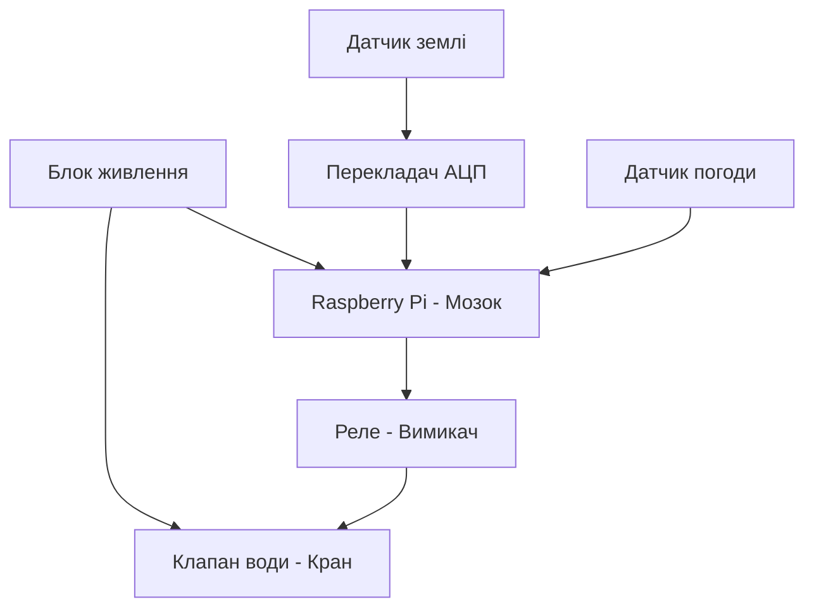

# Курсова робота

## Тема: Контроль поливом

Коваленко Михайло

 Група КС-1-2
 
 ---
 ## Основні ідеї проєкту (завдання) 
 **Опис та підключення датчика:** один датчик згідно з варіантом.
 
  Опис таведення архіву даних на Edge-рівні. 
  
  Опис та підклюінтерфейс для підключення та керування з телефону через WiFi.

   датчика: один датчиреалізація протоколів MQTT, WebSocket та HTTP.

  
 та підключення розробка та впровадження одного основного алгоритму реалізації: одизбір та відображення статистики в хмарі.
  
  
  Опис та підключналаштування автоматичних повідомлень через Discord або Telegram.

### 4. Пошук та вибір апаратного забезпечення

Для реалізації автоматизованої системи поливу було проаналізовано ринок компонентів та обрано наступний комплекс технічних засобів:

1. Керуючий модуль: Raspberry Pi
   * *Обґрунтування*: Забезпечує високу обчислювальну потужність для Edge-обробки даних, підтримує повноцінну ОС Linux та локальну СКБД SQLite. Має вбудовані інтерфейси SPI та GPIO для роботи з периферією.

2. Датчик вологості ґрунту: Capacitive Soil Moisture Sensor v1.2
   * *Обґрунтування*: На відміну від дешевих резистивних датчиків, цей датчик є ємнісним. Його контакти покриті лаком і не контактують із водою напряму, що повністю виключає корозію (іржавіння) та забезпечує довговічність роботи в землі.

3. Аналогово-цифровий перетворювач (АЦП): MCP3008
   * *Обґрунтування*: Оскільки Raspberry Pi не має власних вбудованих аналогових входів (розуміє лише цифровий сигнал "0" або "1"), для зчитування точних значень напруги з ємнісного датчика ґрунту обрано 10-бітний 8-канальний АЦП MCP3008, який працює по надійному протоколу SPI.

4. Датчик погоди: DHT22 (AM2302)
   * *Обґрунтування*: Має вищу точність вимірювання температури (±0.5°C) та вологості повітря (±2%), а також ширший діапазон вимірювань, ніж аналог DHT11. Передає дані по цифровому однопровідному протоколу, не займаючи канали АЦП.

5. Виконавчі пристрої: Модуль реле та Електромагнітний клапан води
   * *Обґрунтування*: Електромагнітний клапан працює від зовнішньої напруги (зазвичай 12V), тоді як GPIO Raspberry Pi видає лише 3.3V. Модуль реле служить безпечним ізольованим «вимикачем», який дозволяє мікрокомп'ютеру керувати потужним силовим навантаженням (відкриттям/закриттям крану).

## 4.1 Розроблення структурної схеми

Опис роботи структурної схеми:
Система працює автоматично. Датчики вологості ґрунту та погоди (DHT22) передають дані на Raspberry Pi. Оскільки датчик ґрунту аналоговий, сигнал проходить через перетворювач АЦП MCP3008. Якщо земля суха, Raspberry Pi через модуль реле відкриває електромагнітний клапан і вмикає полив.

## 5. Опис та підключення датчиків

У моїй курсові роботі я обрав  ємнісний датчик вологості ґрунту Capacitive Soil Moisture Sensor v1.2.

### Принцип роботи датчика:
Датчик вимірює діелектричну проникність ґрунту за допомогою ємнісного вимірювання, що безпосередньо залежить від кількості вологи в землі. На відміну від дешевих резистивних датчиків, цей модуль не має відкритих металевих контактів на щупі, тому він не буде іржавіти в землі, тому прослужить набагато довше в умовах постійної вологості.

### Підключення до Raspberry Pi:
Оскільки датчик видає аналоговий сигнал (напругу, яка змінюється залежно від сухості землі), а Raspberry Pi не має власних аналогових входів (GPIO розуміють тільки "0" або "1"), підключення виконується через аналогово-цифровий перетворювач (АЦП) MCP3008 за такою схемою:

1. Датчик ґрунту ➔ АЦП MCP3008:
   * VCC (живлення) ➔ 3.3V або 5V
   * GND (земля) ➔ GND
   * AOUT (аналоговий вихід) ➔ до аналогового каналу CH0 на мікросхемі MCP3008.

2. АЦП MCP3008 ➔ Raspberry Pi (через інтерфейс SPI):
   * VDD/VREF ➔ 3.3V на Raspberry Pi
   * AGND/DGND ➔ GND на Raspberry Pi
   * CLK (тактування) ➔ GPIO 11 (SCLK)
   * DOUT (вихід даних) ➔ GPIO 9 (MISO)
   * DIN (вхід даних) ➔ GPIO 10 (MOSI)
   * CS/SHDN (вибір мікросхеми) ➔ GPIO 8 (CE0)
## 6. Архівування даних на Edge-рівні

Щоб система поливу працювала стабільно, збір та збереження всієї історії вимірювань я вирішив робити локально. Тобто, дані про вологість землі та погоду збираються й одразу записуються на MicroSD карту самої плати Raspberry Pi.

### Як організовано збереження даних:
* Локальна база даних: Для збереження історії я використовую легку базу даних SQLite. Вона не потребує складного налаштування і працює як один файл прямо на MicroSD карті нашої плати.
* Структура архіву: Програма зчитує датчики кожні 10-15 хвилин та записує в таблицю три параметри: точний час (дата і година), рівень вологості ґрунту та температуру навколишнього середовища.
* Переваги такого підходу: Якщо в саду раптово зникне інтернет або зв'язок із сервером, система не зламається і не втратить дані. Вона продовжить збирати історію локально і зможе автономно приймати рішення про полив рослин.

